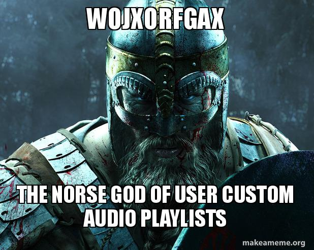

# Wojxorfgax

This is the backend API for APM's cross-site user audio playlist feature. It is designed as a Rails engine for easier integration into other sites.

## Usage

The REST API follows the [JSON::API](http://jsonapi.org/format/) specification. If discrepancies are found, please file a bug report.

### Authentication

The method of authentication is defined by the authorization class as described below. When access is denied, the response will be a 403 Forbidden status code.

### Document format

```json
{
    "data": {
        "attributes": {
            "after": "279323",
            "audio-description": "A description",
            "audio-hosts": "A list of host names",
            "audio-identifier": "01/01/01/blah",
            "audio-program": "The name of the program",
            "audio-title": "The title of the audio",
            "audio-url": "https://example.com/audio/myaudio.mp3",
            "finished": null,
            "origin-url": "https://example.com/stories/my_story",
            "playtime": 123,
            "source": "example.com",
            "status": "unplayed"
        },
        "id": "27932",
        "type": "wojxorfgax-items"
    }
}
```

#### Notes on attributes

##### `after`

The ID of another item with a status of `unplayed` or `playing` and which is also owned by the user. Similar to a linked list.

If you want an item to be the first, explicitly pass `null` as the value.

##### `audio-url`

The URL to the audio. The API doesn't actually care about the format, but the consuming application will need to be able to handle it.

##### `finished`

Should be set to an ISO 8601 datetime when the audio has a status of played. If not provided when the status of the audio changes to played, it will be set to the current datetime.

##### `origin-url`

The URL of the page from which this audio came. Also the page to which the user will be sent if they click on the audio.

##### `playtime`

The last played audio position in whole seconds.

##### `source`

An arbitrary ID defining the broad category source of this audio item. We use it to distinguish various sites, e.g. marketplace, mpr-news, classical-mpr, et cetera.

##### `status`

One of `played`, `unplayed`, and `playing`.

### `GET /users/:uid`

Shows information about the user. It takes the same UID returned by your authentication class as defined below.

### `GET /items`

Provides a list of items for the authenticated user in sort order.

#### Available GET parameters

* `page[size]` The total number of entries to be returned. Maximum is 100.
* `page[number]` The page to be returned.
* `filter[source]` The source(s) to be returned. Multiple sources can be defined using the GET param array syntax: `filter[source][]`.
* `filter[status]` The status(s) to be returned. This also accepts array syntax.

### `POST /items`

Creates a new item. Post body should be in the standard format shown above with the following exceptions:

* ID should be omitted. This will be assigned on save and returned in the response.

In case of success, the response will be the same object with any omitted fields filled in with their defaults and a 200 status code. In case of error, the response will be a 400 status code with a JSON::API errors object.

### `PATCH|PUT /items/:id`

Updates an existing item. Body should be in the standard format shown above with the following exceptions:

* Any field which is omitted will be unmodified.
* If `status` is changed to `played`, but `finished` is omitted, it will be set to the current time.
* If `status` is `played`, `after` is ignored.
* `audio-identifier` is always ignored in update and cannot be changed.

The response will be a 204 status code if successful or a 400 status code with a JSON::API errors object if invalid.

### `DELETE /items/:id`

Removes the specified item from the database.

Response will be a 204 status code if successful.

## Installation

Add this line to your application's Gemfile:

```ruby
gem 'wojxorfgax'
```

And then execute:

```bash
bundle exec
```

Or install it yourself as:

```bash
gem install wojxorfgax
```

After installing, mount the engine at the root of your app.

*Note: Mounting at another endpoint will probably work, but is untested.*

`config/routes.rb`
```ruby
Rails.application.routes.draw do
  mount Wojxorfgax::Engine => '/'
end
```

### Authentication

In order to implement authentication, create an authentication class, and inject it in an initializer:

`config/initializers/wojxorfgax.rb`
```ruby
# frozen_string_literal: true

class StaticAuthPlugin
  def fetch_uid(_request)
    # This would mean that every request is assumed to belong to user 1234.
    '1234'
  end
end

Wojxorfgax.config do |c|
  c.auth_plugin = StaticAuthPlugin.new
end
```

The authentication class must have a `#fetch_uid` method which accepts a request object. It must return a string UID of some kind if authenticated or `nil` if not.

## Contributing

Pull requests welcome! If you are looking at doing any major work, you might want to open a ticket and get a thumbs-up that such a change would be accepted before starting. Thanks!

## License

The gem is available as open source under the terms of the [MIT License](http://opensource.org/licenses/MIT).

## What the heck is up with that name?

For this project, no simple name would do (read: we weren't feeling creative), so we turned to our sophisticated name generation system:

```bash
openssl rand -base64 28
```

In a singular event of significant universal significance (aka, every time a random number generator runs), it spat out a sequence of letters, numbers, and symbols. The numbers and symbols were useless, so they were removed. The string was lopped to a reasonable length, only the first character was capitalized, and out came… `Wojxorfgax`. Which was wonderful, because the vowel to consonant ratio was vaguely pronounceable.

But what does this mean? There are a number of key elements of the name, we can go through. First of all, I immediately notice the XOR. This is a boolean operator of incredible significance and the basis of all arithmetic adders. However, also using that sequence of characters is the string "orf", which is of course a coded reference to Carl Orff, the composer of Carmina Burana, among other works. This is highly appropriate given APM's work in the arts, as well as Carmina Burana's emphasis on the wheel of fortune which itself spawned this application's name. At the end of the name are the letters "fax" (with a g randomly in the middle), which reminds one of "Shadowfax", the steed of Gandalf and the greatest of the horses of the Rohirrim. Finally, the letters "W" and "j" in such close proximity at the beginning are vaguely scandinavian, resulting in:



The name was also going to be easy to run Find/Replace against for when we picked a real name. That didn't happen…
